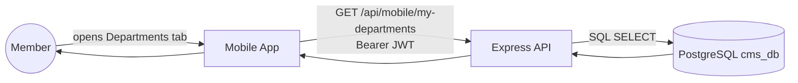
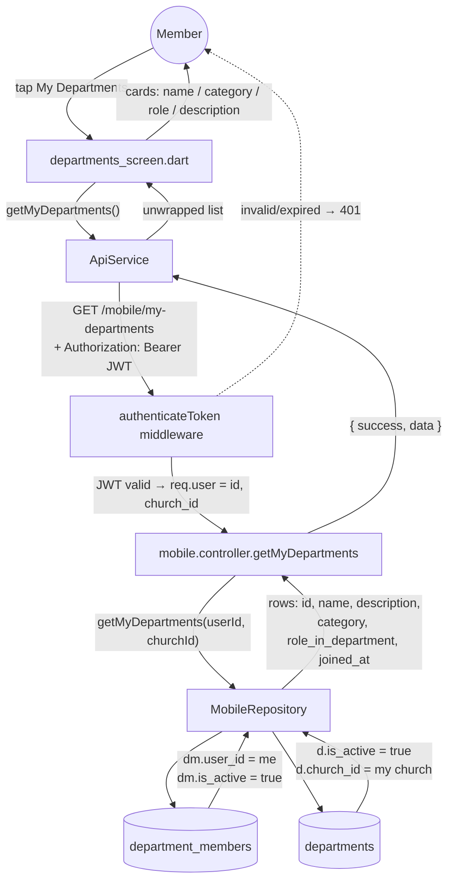
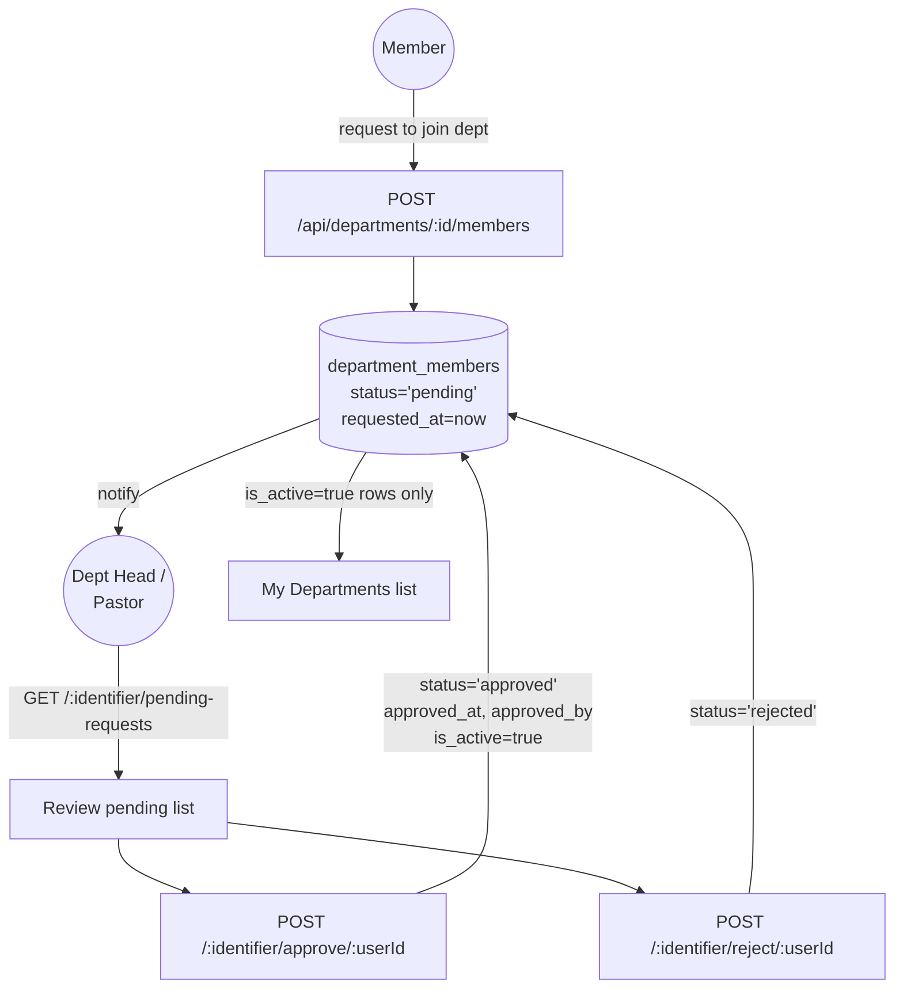
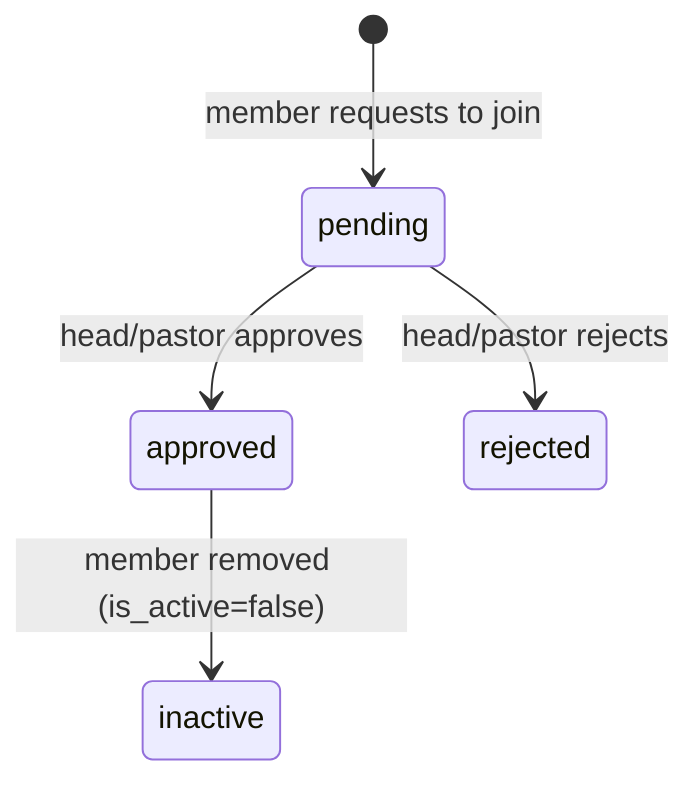
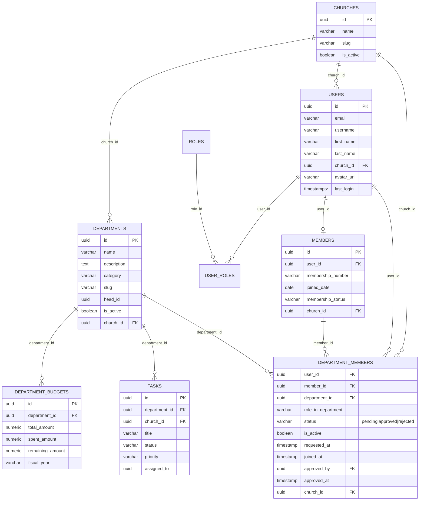

# "My Departments" Workflow — KMainCMS

Scope: what happens when a member taps **My Departments** on the mobile app
(or navigates the web equivalent), how membership requests get approved, and
how the tables relate.

Code touched by this flow:

- `mobile/flutter/flutter-mobile/lib/screens/departments_screen.dart`
- `mobile/flutter/flutter-mobile/lib/services/api_service.dart` (`getMyDepartments`)
- `backend/routes/mobile.routes.js` → `GET /api/mobile/my-departments`
- `backend/controllers/mobile.controller.js` → `getMyDepartments`
- `backend/repositories/MobileRepository.js` → `getMyDepartments`
- `backend/routes/departments.routes.js` → membership request/approve/reject
- Tables: `churches`, `departments`, `department_members`, `users`, `members`

## 1. How it works, step by step

1. **Dashboard count** — `GET /api/mobile/dashboard` runs a member-scoped count
   of `department_members` where `user_id = <you> AND is_active = true`
   (that's what the *My Departments* stat card shows).
2. **Tap the card** → Flutter routes to `/departments`
   (`context.push('/departments')`).
3. **Screen loads** → `departments_screen.dart` calls
   `ApiService.getMyDepartments()` → `GET /api/mobile/my-departments`
   with the user's Bearer JWT.
4. **Backend resolves the JWT** → `req.user.id` + `req.user.church_id`
   (tenant isolation — you can only ever see your own church's departments).
5. **Repository query**:

   ```sql
   SELECT d.id, d.name, d.description, d.category,
          dm.role_in_department, dm.joined_at
   FROM department_members dm
   JOIN departments d ON d.id = dm.department_id
   WHERE dm.user_id = $1        -- the logged-in user
     AND dm.is_active = true    -- only approved memberships
     AND d.is_active = true     -- only live departments
     AND d.church_id = $2       -- tenant scope
   ORDER BY d.name
   ```
6. **Response** → `{ success, data: { data: [ ...rows ] } }`
   (double `data` — `api_service._unwrapData` strips it) → each row renders
   as a card with **name, category chip, your role in the department, and
   description**.
7. **Empty state** — if you belong to none, the screen shows a prompt instead
   of errors.

## 2. DFD

### Level 0 — context



### Level 1 — decomposed



### Membership request & approval (how a row gets into `department_members`)



**Status lifecycle in `department_members`:**



Only `status='approved' AND is_active=true` rows appear in *My Departments*.

## 3. ERD



### Key relationships

- **`department_members` is the join table** between `users` (or `members`) and
  `departments` — it carries both `user_id` (login identity) and `member_id`
  (church record), plus role/status/approval audit columns.
- **Tenant isolation**: every row carries `church_id`; the query filters on
  `d.church_id = req.user.church_id`, so a member of New Life can never see
  Mount Horeb's departments.
- **`departments.head_id`** points at the department leader (used by the
  Department Head dashboard for dept-scoped stats).
- **`role_in_department`** is the member's *function inside the dept*
  (e.g. "Department Head", "Secretary") — distinct from the global RBAC role.

## 4. Request/response contract

```http
GET /api/mobile/my-departments
Authorization: Bearer <jwt>
```

```json
{
  "success": true,
  "message": "Success",
  "data": {
    "data": [
      {
        "id": "ae035c1e-…",
        "name": "Choir",
        "description": "Music ministry…",
        "category": "Worship",
        "role_in_department": "Member",
        "joined_at": "2026-09-23T10:41:00Z"
      }
    ]
  }
}
```

Web equivalent endpoints (same tables, richer data):

- `GET /api/departments/:identifier/dashboard` — dept dashboard (members, pending requests)
- `GET /api/departments/:identifier/pending-requests` — approval queue
- `POST /api/departments/:identifier/approve|reject/:userId` — decision
- `GET /api/departments/:departmentId/statistics|activity|budget|members` — drill-downs
- `GET /api/mobile/departments` — browse *all* active church departments (used by the departments list when you aren't scoped to "mine")

## 5. What's verified vs. what's stubbed

- **Verified live**: dashboard count, `my-departments` list, dept detail, pending-requests queue.
- **Verified local (all in smoke test)**: member can see exactly 2 departments, correct `role_in_department`.
- **Stubbed/not yet wired on mobile**: in-app "join department" button, pending-request badge, dept activity feed (endpoints exist — the Flutter screens don't call them yet).

## 6. Improvement ideas

1. **Join/leave actions** on `departments_screen.dart` → `POST /departments/:id/members` + leave → `DELETE`
2. **Pending-request badge** on the My Departments card
3. **Dept detail sheet** — tap a card → members, upcoming events, activity feed (`/api/departments/:id/activity`)
4. **Head contact** — show `head_id` name/phone on the card
